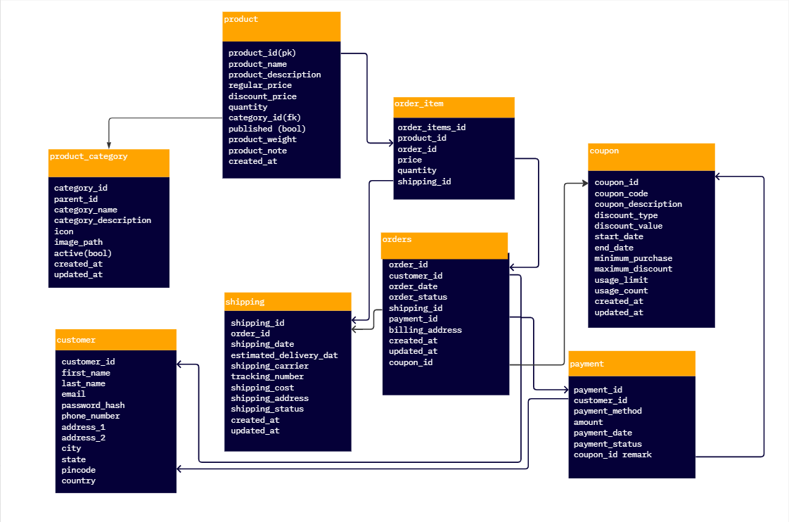

# ecommerce_app
This repository holds all the ecommerce specific database elements.

Here is the ER Representation of the ecommerce_database.

<br>
<br>
This section contains DDL Documentation that explains DDL usage for creating the Database.
<br><br>
Step - 1 : Create all the tables with defined fields using CREATE TABLE statement.

CREATE TABLE: Used to create a new table in the database.<br>
Syntax:
```
CREATE TABLE table_name (
  column1 datatype constraint,
  column2 datatype constraint,
  ...
  columnN datatype constraint
);
 ```
 <br>
Step - 2 : After creating the empty tables, Insert the values into the tables. This can be achieved by using INSERT INTO Statement.<br>

INSERT INTO : Used to Insert the values into the table.<br>
Syntax :
``` 
INSERT INTO table_name (
  column1, column2, column3, ...) VALUES (value1, value2, value3, ...);
```
<br>
Note : You can also load the data from .csv files using the below code

```
COPY table_name(col1, col2, col3, col4,.......,col n)
FROM 'path/to/csvfile'
DELIMITER ','
CSV HEADER;
 ```
### Table Description for each table in this ecommerce database - 
### Table: product

| Field             | Type    | Description                             |
|-------------------|---------|-----------------------------------------|
| product_id        | INT     | Unique identifier for the product.      |
| product_name      | TEXT    | Name of the product.                    |
| product_description | TEXT  | Description of the product.             |
| regular_price     | DECIMAL | Regular price of the product.           |
| discount_price    | DECIMAL | Discounted price of the product.        |
| quantity          | INT     | Available quantity of the product.      |
| category_id       | INT     | Foreign key to link with the category table. |
| published         | BOOL    | Boolean flag indicating if the product is published or not. |
| product_weight    | DECIMAL | Weight of the product.                  |
| product_note      | TEXT    | Additional notes or details about the product. |
| created_at        | DATETIME | Date and time when the product was created. |

### Table: product_category

| Field             | Type    | Description                             |
|-------------------|---------|-----------------------------------------|
| category_id       | INT     | Unique identifier for the category.     |
| parent_id         | INT     | Identifier of the parent category (if applicable). |
| category_name     | TEXT    | Name of the category.                   |
| category_description | TEXT  | Description of the category.            |
| icon              | TEXT    | Icon associated with the category.      |
| image_path        | TEXT    | File path to the image representing the category. |
| active            | BOOL    | Boolean flag indicating if the category is active or not. |
| created_at        | DATETIME | Date and time when the category was created. |
| updated_at        | DATETIME | Date and time when the category was last updated. |

### Table: customer

| Field             | Type    | Description                             |
|-------------------|---------|-----------------------------------------|
| customer_id       | INT     | Unique identifier for the customer.     |
| first_name        | TEXT    | First name of the customer.             |
| last_name         | TEXT    | Last name of the customer.              |
| email             | TEXT    | Email address of the customer.          |
| password_hash     | TEXT    | Hashed password of the customer.        |
| phone_number      | TEXT    | Phone number of the customer.           |
| address_1         | TEXT    | Address line 1 of the customer.         |
| address_2         | TEXT    | Address line 2 of the customer (optional). |
| city              | TEXT    | City of the customer.                   |
| state             | TEXT    | State of the customer.                  |
| pincode           | TEXT    | Postal code of the customer.            |
| registered_at     | DATETIME | Date and time of customer registration.  |
| created_at        | DATETIME | Date and time when the customer record was created. |

### Table: order_item

| Field             | Type    | Description                             |
|-------------------|---------|-----------------------------------------|
| orderitems_id     | INT     | Unique identifier for the order item.   |
| product_id        | INT     | Foreign key to link with the product table. |
| order_id          | INT     | Foreign key to link with the order table. |
| price             | DECIMAL | Price of the product in the order item. |
| quantity          | INT     | Quantity of the product in the order item. |
| shipping_id       | INT     | Foreign key to link with the shipping table. |

### Table: orders

| Field             | Type    | Description                             |
|-------------------|---------|-----------------------------------------|
| order_id          | INT     | Unique identifier for the order.        |
| customer_id       | INT     | Foreign key to link with the customer table. |
| order_date        | DATETIME | Date and time when the order was placed. |
| order_status      | TEXT    | Status of the order (e.g., Shipped, Processing, Delivered). |
| shipping_id       | INT     | Foreign key to link with the shipping table. |
| payment_id        | INT     | Foreign key to link with the payment table. |
| coupon_id         | INT     | Foreign key to link with the coupon table. |

### Table: shipping

| Field             | Type    | Description                             |
|-------------------|---------|-----------------------------------------|
| shipping_id       | INT     | Unique identifier for the shipping.     |
| order_id          | INT     | Foreign key to link with the order table. |
| shipping_date     | DATETIME | Date and time when the shipping process started. |
| estimated_delivery_date | DATETIME | Estimated date of delivery.          |
| shipping_carrier  | TEXT    | Shipping carrier (e.g., UPS, FedEx).    |
| tracking_number   | TEXT    | Tracking number for the shipment.       |
| shipping_cost     | DECIMAL | Cost of shipping.                       |
| shipping_address  | TEXT    | Shipping address for the order.         |
| shipping_status   | TEXT    | Status of the shipping (e.g., Shipped, In Transit, Delivered). |
| created_at        | DATETIME | Date and time when the shipping record was created. |
| updated_at        | DATETIME | Date and time when the shipping record was last updated. |

### Table: coupon

| Field             | Type    | Description                             |
|-------------------|---------|-----------------------------------------|
| coupon_id         | INT     | Unique identifier for the coupon.       |
| coupon_code       | TEXT    | Coupon code for applying discounts.     |
| coupon_description | TEXT  | Description of the coupon.              |
| discount_type     | TEXT    | Type of discount (Percentage, Fixed).   |
| discount_value    | DECIMAL | Value of the discount.                  |
| start_date        | DATE    | Start date of the coupon validity.      |
| end_date          | DATE    | End date of the coupon validity.        |
| minimum_purchase  | DECIMAL | Minimum purchase amount required to use the coupon. |
| maximum_discount  | DECIMAL | Maximum discount amount applicable using the coupon. |
| usage_limit       | INT     | Maximum number of times the coupon can be used. |
| usage_count       | INT     | Number of times the coupon has been used. |
| created_at        | DATETIME | Date and time when the coupon was created. |
| updated_at        | DATETIME | Date and time when the coupon was last updated. |

### Table: payment

| Field             | Type    | Description                             |
|-------------------|---------|-----------------------------------------|
| payment_id        | INT     | Unique identifier for the payment.      |
| customer_id       | INT     | Foreign key to link with the customer table. |
| payment_method    | TEXT    | Payment method used (e.g., Credit Card, PayPal). |
| amount            | DECIMAL | Payment amount.                         |
| payment_date      | DATETIME | Date and time when the payment was made. |
| payment_status    | TEXT    | Status of the payment (e.g., Success, Failed). |
| coupon_id         | INT     | Foreign key to link with the coupon table. |
| remarks           | TEXT    | Additional remarks or notes about the payment. |